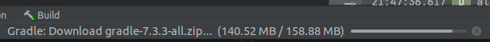
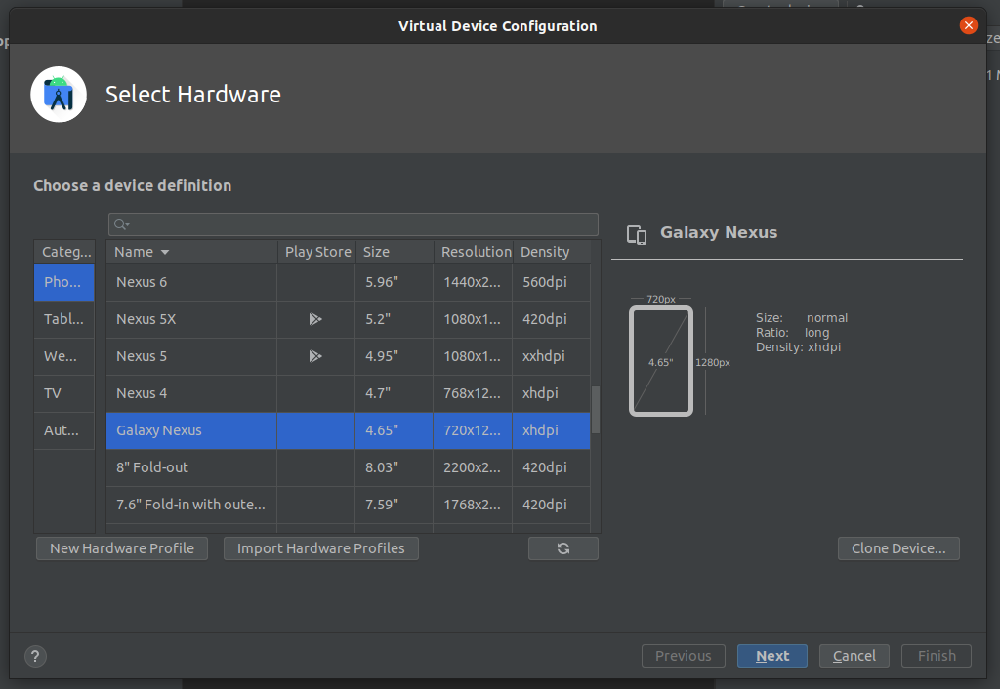
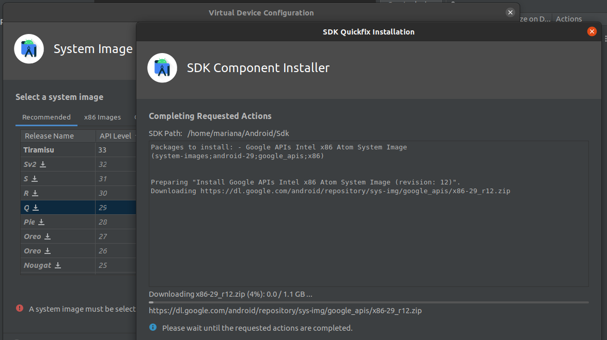
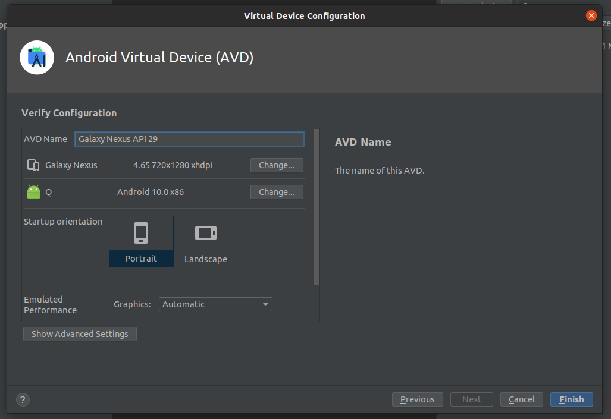
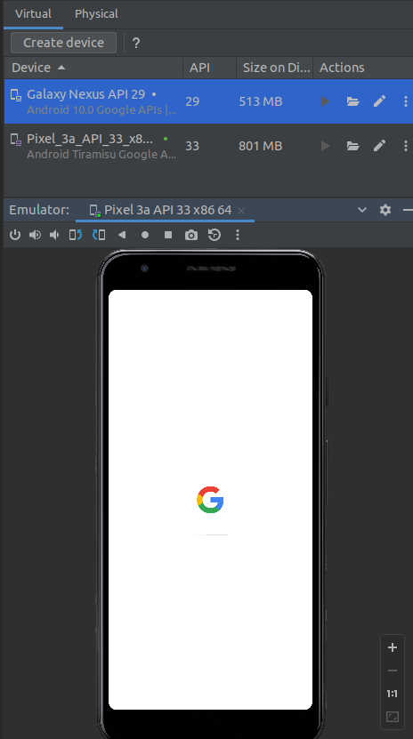
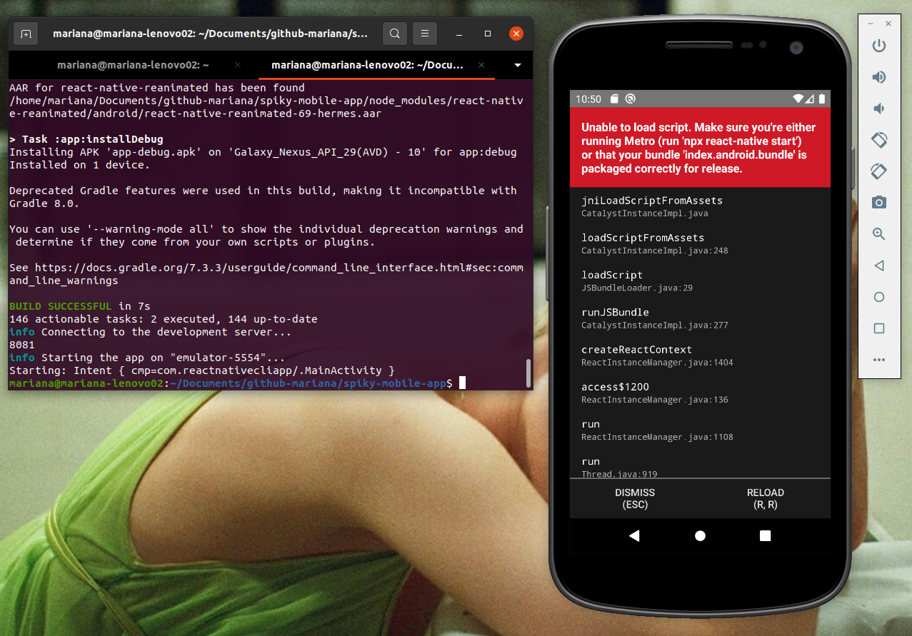

# Development Set Up

## Linux Based OS (Ubuntu 20.04 - tested)

1. Clone the repository:

```
git clone git@github.com:Spiky-App/spiky-mobile-app
```

2. Install all dependencies:

```
npm install
```

3. Install android studio

```
sudo apt-get install openjdk-8-jdk 
sudo apt-get update
sudo add-apt-repository ppa:maarten-fonville/android-studio
sudo apt update
sudo apt install android-studio
```

4. Open/create a file called `./.bash_profile` and paste the following lines:

```
export ANDROID_HOME=$HOME/Android/Sdk 
export PATH=$PATH:$ANDROID_HOME/tools 
export PATH=$PATH:$ANDROID_HOME/platform-tools
```

5. Install dev tools:

```
sudo apt-get install autotools-dev
sudo apt-get install aclocal 
sudo apt-get install automake
```

6. Install Watchman: a facebook tool for file surveying

```
git clone https://github.com/facebook/watchman.git 
cd watchman 
git checkout v4.9.0
sudo apt-get -y install libtool
./autogen.sh 
./configure 
make 
sudo make install 
```

7. Install flow: allows you to easily add JavaScript to the static type check. It also helps to prevent bugs and makes documentation easier.

```
wget https://github.com/facebook/flow/releases/download/v0.62.0/flow-linux64-v0.62.0.zip 
unzip flow-linux64-v0.62.0.zip 
cd flow 
sudo mv flow /usr/local/bin/flow
```

8. Install react native and yarn:

```
sudo npm install -g react-native-cli
```

9. Run on android:

```
cd spiky-mobile-app
react-native run-android 
```

10. Open Android Studio and open the `./android/` folder. Android Studio will automatically start downloading the gradle and build it, which you can see in the bottom part of android studio:



## Install An Android Studio Emulator

11. Inside Android Studio, go to View > Tool Windows > Device Manager and click on *Create Device* to create a virtual device.

12. Select the hardware and click on *Next*:



13. Select the system image (or download it) for an specific API level and click on *Next*.



14. Click on *Finish* and now you will see your virtual device listed.



15. You can run the emulator from Android Studio, but do it from bash:

    

    - locate your Android Sdk: `home/mariana/Android/Sdk/emulator`

    - open your dot file `.profile` and `.bashrc` and add this lines:

    ```
    # Extend PATH variable with ANDROID_SDK emulator tools            
    export PATH="${HOME}/Android/Sdk/emulator:${PATH}"    
    ```
    *Note: don't add /tools nor /platform-tools to PATH.*

    - Re-open your terminal and now you can run from home directory:

    ```
    emulator -list-avds
    emulator -avd [any name from output of the above command]
    ```
    to open the emulator from the shell. but don't do it.

16. Go back and run the app (install adb if you haven't). It will open the emulator:

```
sudo apt install adb
react-native run-android
```

(Don't forget to turn on the server, on the spiky-back-end repo)

*Note: it helps if you run emulator -avd your_em and quit it, then this react-native command.*

